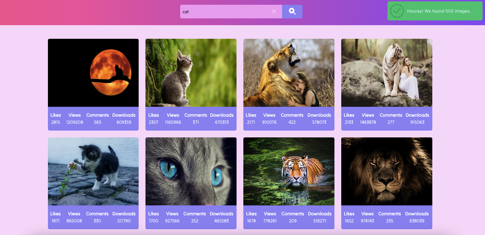

Build a front-end part of a keyword search and image viewer application. Add
some decoration to the interface elements.

- Project built with parcel-project-template.
- For HTTP requests, the axios library is used.
- Pagination.
- async/await syntax.
- For notifications, the notiflix library is used.
- Infinite scrolling.

